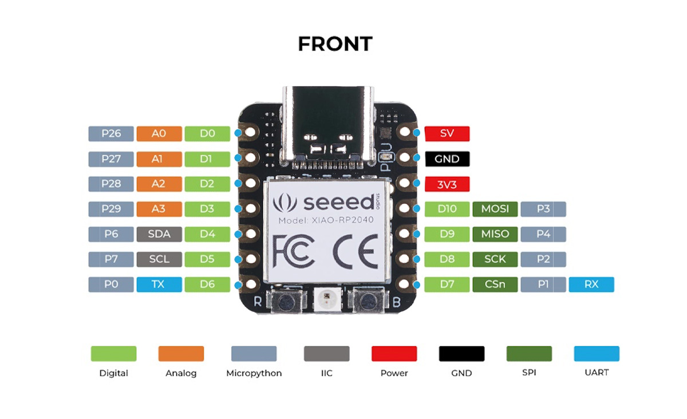
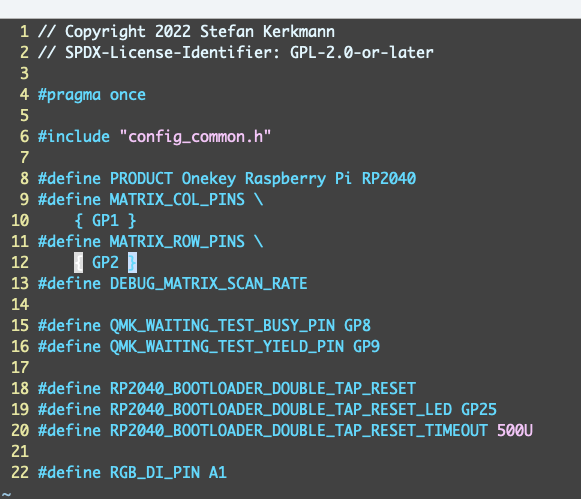
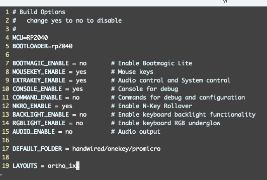

# A Macro Pad with XIAO RP2040

## Index

- [A Macro Pad with XIAO RP2040](#a-macro-pad-with-xiao-rp2040)
  - [Index](#index)
  - [Overview](#overview)
  - [Hardware](#hardware)
    - [RP2040](#rp2040)
    - [Pintout](#pintout)
    - [PCB](#pcb)
    - [Top Plate](#top-plate)
    - [Accessibility Extention](#accessibility-extention)
  - [Software](#software)
      - [code.py](#codepy)
      - [Issue: Recognized as USB Drive every time](#issue-recognized-as-usb-drive-every-time)
      - [Solution: Make USB Driver Mount optional](#solution-make-usb-driver-mount-optional)
    - [QMK: qmk firmware](#qmk-qmk-firmware)
    - [Notes](#notes)
  - [References](#references)

## Overview

If the Macro Pad has only a few keys, circuitpython is one of the easiest way to use because it does not require compile for execution and does not require building development environment for configuration changes. Since the microcontroller is recognized as a USB drive, you can change key assignments easily by editing with text editor. On the other hand, it is possible to disable recognition as a USB drive at startup, to avoid extra warning messages on the Mac.
For hardware, XIAO RP2040 is recommended to use because it is small footprint, low cost, and USB-C connector.  It is better than Pro Micro that is widely used in DIY keyboard community.

This macro pad features a single 3.5mm TRRS compatible accessibility port. For example, it can accommodate any switch, including footswitches and emergency switches.

More details.
- The software runtime environment is circuitpython provided by Adafruit.
- Since CircuitPythin can recognize the RP2040 as a USB Mass Storage, it is possible to change key assignments using only text edtior.
- However, if the RP2040 is recognized as a USB drive every time, it may cause problems such as changing the configuration file by mistake or displaying a warning message in the case of MacOS.
- Therefore, I made it possible to operate only as a USB Keyboard without enabling the USB Mass Storage function in the switch state.  For more details on the technology, click here.
[https://learn.adafruit.com/circuitpython-essentials/circuitpython-storage]
- In addtition, an implementation in the widely used qmk firmware is also shown.  QMK is now compatible with RP2040 in August 2022, and I have confirmed that it works with qmk firmware.
  
  


## Hardware

The RP2040 is used as the microcontroller. The Pro Micro and Teensy microcontrollers in general use do not have a Type-C USB connector and are not robust. In addition, the size of the Flash memory is small, and when adding functions to a program, it may not be able to hold the program.

### RP2040

The microcontroller used to operate the USB device is Seeed's XIAO RP2040, which has 2MB of stroage compared to the Pro Micro and is virtually free from program size restrictions. 2MB of Flash memory is available compared to 32KB of Pro Micro.

Comparison table between Pro Micro and XIAO RP2040

|     | ProMicro | XIAO RP2040 |
| --- | --- | --- |
| Connector | Micro-USB | USB-C |
| MPU | ATMega 32U4（5V/16 MHz）| Dual Core Arm Cortex-M0+ Processor 133 MHz |
| Storage capacity | 2.5K Bytes SRAM, 32K Bytes Flash memory | 264 KB SRAM、2MB Onboard Flash memory |
| Pin | 12 digital + 9 analog | 11 digital, 4 analog |
| Size | 3.30 x 1.78cm | 20 x 17.5 x 3.5 mm |
| Features| | reset switch and user LED are available |

### Pintout

- A total of five switches are provided here.
- D1, D3, D4, and D5 can be assigned any key.
- D2 (tact switch) has a function to enable USB mass storage when a keyboard is connected with the switch held down.

- The wiring is quite simple: each pin and GND are connected by a switch. For example, D1 - switch - GND.  Since there are many pins, it is not necessary to use Diode to increase the number of pins, and it is possible to judge that they are pushed independently.

|Pin #| Description |
| --- | --- |
|D1| Any key |
|D2| Boot select with or without USB Mass-storage function |
|D3| Any key |
|D4| Any key |
|D5| Any key |

### PCB
 
The supported switches are Cherry MX compatible and Choc thin type.
Each of these switches is implemented using a socket for the switch, and currently cannot be connected without a socket.


### Top Plate

Cherry MX Switch can be used as it is, but some thinner Choc Switch may not fit in the switch due to its small size. In such a case, you can widen the size of the switch by filing it slightly in the horizontal direction.

### Accessibility Extention

Here is an example to add extra push switch.  You can push the button when you are just relaxed...

  


## Software

We will utilize Adafruit's HID Library.

#### code.py

Place the following code in the top directory

```python:code.py
# import
import time
import board
import digitalio
import usb_hid
# keyboard
from adafruit_hid.keyboard import Keyboard
from adafruit_hid.keycode import Keycode
from adafruit_hid.keyboard_layout_us import KeyboardLayoutUS
# mouse
from adafruit_hid.mouse import Mouse


kbd = Keyboard(usb_hid.devices)
layout = KeyboardLayoutUS(kbd)

# define buttons. these can be any physical switches/buttons
switch = digitalio.DigitalInOut(board.D1)
switch.direction = digitalio.Direction.INPUT
switch.pull = digitalio.Pull.UP #software setting, pull up

# debug
#print("Hello World!  D1-PULLUP")
while True:
    if switch.value == 0: # if switch pushed
       # kbd.send(Keycode.ENTER)
       layout.write("www.yahoo.com\n")
    time.sleep(0.1)

```

#### Issue: Recognized as USB Drive every time

Since it is recognized as a USB Drive every time, the message that it could not be ejected successfully on a Mac is noisy, and there is no need to recognize it as a USB Drive since it is not rewritten every time in the first place.


#### Solution: Make USB Driver Mount optional

In circuitpython, boot.py and code.py in the root directory are loaded in this order, so prepare boot.py so that it will be recognized as a USB Drive and mounted when booted with Switch D2 pressed.

Specifically, if a file named boot.py is placed, it will be read and executed first before code.py.
Here, a switch is prepared so that the device will be recognized as a USB Drive when it is connected to USB with the switch pressed.

```python: boot.py

import storage
import board
import digitalio
from time import sleep
import usb_hid

usb_hid.enable((usb_hid.Device.KEYBOARD,))

button = digitalio.DigitalInOut(board.D3)
button.pull = digitalio.Pull.UP 

if button.value:
    storage.disable_usb_drive()
    sleep(0.1)
else:
   sleep(1)f

```

This will make it work.


### QMK: qmk firmware

An example implementation with qmk firmware is shown below. The corresponding version is QMK Firmware 0.17.7.
Since there are enough pins for the number of microcontrollers on the PCB, we do not use a matrix array with diodes, but connect directly to the pins of the microcontrollers. The implementation is shown below.

```
[qmk_firmware/keyboards/my4pad] tree
.
├── README.md
├── config.h
├── keymaps
│   └── default
│       ├── config.h
│       └── keymap.c
├── my4pad.c
├── my4pad.h
└── rules.mk
```

The following three points are key points.

```:config.h
/* key matrix size */
#define MATRIX_ROWS 1
#define MATRIX_COLS 5
.
.
#define DIRECT_PINS { { GP27, GP28, GP29, GP6, GP7 } }
.
.
#define ENCODERS_PAD_A { GP1 }
#define ENCODERS_PAD_B { GP2 }
```

Then, in rules.mk, specify the microcontroller, etc. to be used. The following two points are important.

```rules.mk
[08/13/22 16:19 /Users/k/src/0812/qmk_firmware/keyboards/my4pad] cat rules.mk
MCU = RP2040
BOOTLOADER = rp2040
```

Next, look at the header file, where five keys are defined.
```my4pad.h
[08/13/22 16:21 /Users/k/src/0812/qmk_firmware/keyboards/my4pad] cat my4pad.h
#define LAYOUT( \
    k00, k01, k02, k03, k04 \
  ) \
  { \
    { k00, k01, k02, k03, k04 } \
  }
  ```

The following is the definition of keys actually used in keymap.c.
In the example below, four keys are assigned cursor keys. The small tact switch is assigned the letter R as in the test.

```keymap.c
const uint16_t PROGMEM keymaps[][MATRIX_ROWS][MATRIX_COLS] = {

  [0] = LAYOUT( /* Base */
    KC_DOWN, // One switch in front
    KC_R,   // A small tact switch
    KC_LEFT, KC_UP, KC_RIGHT // Three switches in the back
  ),

  [1] = LAYOUT(
    XXXXXXX,  XXXXXXX,  XXXXXXX,  XXXXXXX, XXXXXXX
  ),

  [2] = LAYOUT(
    _______,  RGB_HUI,  RGB_SAI,  RGB_VAI, RGB_MOD
  ),
};
```


### Notes
In XAIO, the pin layout is different: D1 and D2 are not P1 and P2, respectively, and the circuit python shows that P1 and P2 in XIAO correspond to PG1 and PG2.

  

  

  

## References

- [1] Sparkfun [ProMicro](https://www.sparkfun.com/products/12640)
- [2] Seeed [XIAO RP2040](https://www.seeedstudio.com/XIAO-RP2040-v1-0-p-5026.html)
- [3] QMK [QMK firmware](https://qmk.fm/)
  
